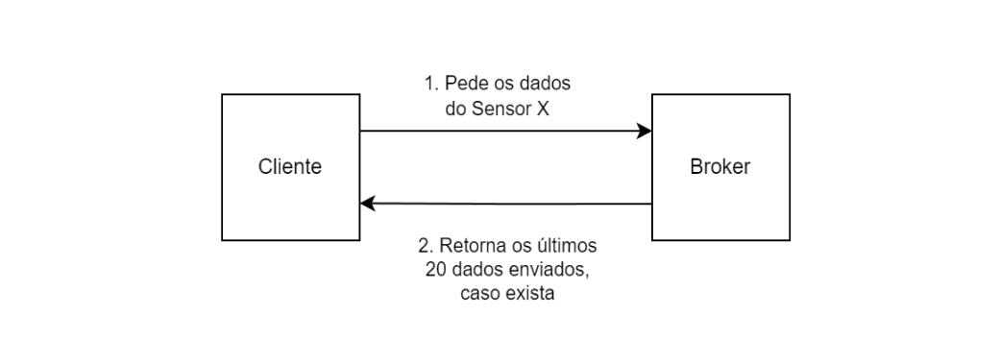
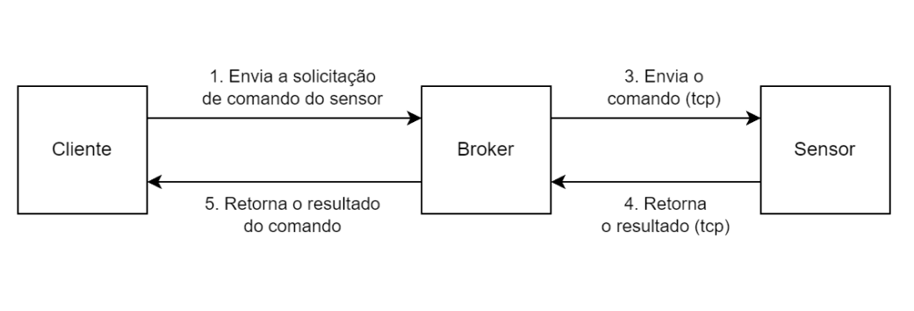

<div align="center">
  <h1>IoT Connect - Gerenciamento de dispositivos IOT</h1>
  <p>
    <strong>Projeto desenvolvido para a disciplina TEC502 - MI Concorrência e Conectividade</strong>
  </p>

  
  
</div>

<p>
  O objetivo do IOT Connect é criar um sistema de comunicação e gerenciamento entre dispositivos IOT e suas diferentes aplicações. O sistema deve ser capaz de criar, remover e verificar o status de dispositivos IOT, além de receber, armazenar e disponibilizar dados dos dispositivos IOT para aplicações web.
</p>

## Sobre o projeto
### Tecnologias utilizadas
- Client
  - [React](https://reactjs.org/): Biblioteca JavaScript para a criação de interfaces de usuário.
  - [Vite](https://vitejs.dev/): Ferramenta de build para aplicações web.
  - [TypeScript](https://www.typescriptlang.org/): Superset da linguagem JavaScript que adiciona tipagem estática ao código.
  - [TanStack Query](https://tanstack.com/query/latest): Biblioteca para gerenciamento de estado e requisições HTTP. Responsável por fazer a comunicação com o Broker.
- Broker
  - [Go](https://golang.org/): Linguagem de programação utilizada para o desenvolvimento do Broker.
  - [Gin](https://gin-gonic.com/) Framework web utilizado para a criação das rotas HTTP e API REST.
- Sensores
  - [Python](https://www.python.org/): Linguagem de programação utilizada para o desenvolvimento dos Sensores.

### Pré-requisitos
O sistema foi desenvolvido utilizando Docker e Docker Compose. Assim, para executar o projeto, é necessário ter o Docker e o Docker Compose instalados na máquina.

- [Docker](https://docs.docker.com/get-docker/)
- [Docker Compose](https://docs.docker.com/compose/install/)

### Como executar
1. Clone o repositório:

```bash
git clone https://github.com/jnaraujo/tec502-iot-connect
```

2. Entre na pasta do projeto:

```bash
cd tec502-iot-connect
```

3. Execute o comando:

```bash
docker-compose up --build
```

4. Acesse a aplicação em [http://localhost:3000](http://localhost:3000)

### Como utilizar
#### Como adicionar um novo sensor
<div align="center">
 <br/>
<em>Figura 1. Modal para adicionar um novo sensor</em> <br/>
</div>

Para adicionar um novo sensor, clique no botão "+" na caixa de "Lista de Sensores". Digite um ID único para o sensor e o endereço IP do sensor (ex: 172.19.0.2:3333 ou 172.19.0.4:3334). Clique em "Adicionar Sensor". Uma mensagem irá aparecer informando se o sensor foi adicionado com sucesso ou se houve algum erro.

#### Como enviar um comando para um sensor
<div align="center">
 <br/>
<em>Figura 2. Caixa para enviar um comando para um sensor</em> <br/>
</div>

Para enviar um comando para um sensor, na caixa "Enviar comando", selecione o id do sensor em "Sensor ID", selecione o comando que deseja enviar em "Comando", escreva o conteúdo do comando (se necessário) e clique em "Enviar Comando". Uma mensagem irá aparecer informando se o comando foi enviado com sucesso ou se houve algum erro.

#### Como visualizar os dados de um sensor
<div align="center">
 <br/>
<em>Figura 3. Caixa para visualizar os dados de um sensor</em> <br/>
</div>

Na caixa "Respostas dos sensores" irá aparecer todos os dados recebidos dos sensores, bem como o ID do sensor que enviou o dado, qual o comando, o conteúdo do dado, um histórico de envio e a data de envio.

#### Como remover um sensor
<div align="center">
 <br/>
<em>Figura 4. Remover um sensor</em> <br/>
</div>

Para remover um sensor, na caixa de "Lista de sensores", clique no ícone de lixeira ao lado do sensor que deseja remover. Um modal irá aparecer perguntando se você realmente deseja remover o sensor. Clique em "Remover" para confirmar a remoção.

#### Envio de comandos pelo terminal do Sensor
O terminal do Sensor permite enviar comandos para o Broker. Para isso, basta digitar o comando no terminal e pressionar Enter. O Sensor irá enviar o comando para o Broker e aguardar a resposta. O terminal do Sensor é útil para testar a comunicação entre o Sensor e o Broker.

> Vale destacar se o Sensor estiver rodando através do Docker, é necessário utilizar o comando `docker exec -it <container_id> bash` para acessar o terminal do Sensor. O Docker Compose não permite a execução de comandos interativos.

## Arquitetura do projeto
As principais pastas do projeto são:

- `client`: Aplicação web desenvolvida em React.
- `broker`: Serviço de mensageria desenvolvido em Go.
- `sensor`: Simulação de dispositivos IOT desenvolvida em Python.

### Client
Dentro da pasta `client`, temos o código da aplicação web desenvolvida em React. A aplicação é responsável por criar, remover e visualizar dispositivos IOT, além de visualizar os dados enviados pelos dispositivos.

```bash
client
├── src # Código fonte da aplicação
│   ├── components # Componentes React
│       │── sensor-list-box # Componente que exibe a lista de sensores
│       │── sensor-response-list-box # Componente que exibe a lista de respostas dos sensores
│       │── ui # Componentes genéricos, como botões e inputs
│       │── chart.tsx # Componente que exibe um gráfico de linhas
│       │── send-command-box.tsx # Componente que exibe o formulário para envio de comandos
│   ├── constants # Constantes utilizadas na aplicação
│   ├── hooks # Funções para gerenciamento de estado
│       │── use-command-list.ts # Responsável por buscar os comandos disponíveis para um determinado sensor
│       │── use-create-sensor.ts # Responsável por criar um novo sensor
│       │── use-delete-sensor.ts # Responsável por deletar um sensor
│       │── use-send-command.ts # Responsável por enviar um comando para um sensor
│       │── use-sensor-list.ts # Responsável por buscar a lista de sensores
│       │── use-sensor-responses.ts # Responsável por buscar as respostas (dados) de um sensor
│   ├── lib # Funções utilitárias
│   ├── routes # Rotas da aplicação
│   ├── env.ts # Variáveis de ambiente
│   ├── index.css # Estilos globais
│   ├── main.tsx # Ponto de entrada da aplicação
```

### Broker
Dentro da pasta `broker`, temos o código do serviço de mensageria desenvolvido em Go. O Broker é responsável por permitir a troca de mensagens entre os dispositivos e as aplicações que precisam desses dados. O Broker é responsável por receber os dados dos Sensores, armazenar esses dados e disponibilizá-los para as aplicações.

```bash
broker
├── cmd # Comandos para execução do Broker
│   │── api/main.go # Ponto de entrada da API REST
├── internal # Código interno do Broker
│   │── cmd # Protocolo para simplificar de comunicação entre o Broker e os Sensores
│   │── constants # Constantes utilizadas no Broker
│   │── http # Código para criação das rotas HTTP
│       │── routes # Rotas da API REST
│       │── http.go # Configuração do servidor HTTP
│   │── queue # Estrutura de dados para armazenar os dados dos Sensores
│   │── sensor_conn # Responsável por gerenciar a conexão com os Sensores via TCP/IP
│   │── storage # Responsável por armazenar os dados dos Sensores
│   │── time # Funções utilitárias para manipulação de tempo
│   │── udp_server # Responsável por receber os dados dos Sensores via UDP
│   │── utils # Funções utilitárias
```

### Sensores
Dentro da pasta `sensor`, temos o código dos Sensores, que são responsáveis por simular dispositivos IOT que enviam dados para o Broker. Os Sensores são desenvolvidos em Python.

```bash
sensor
├── libs # Bibliotecas utilizadas
│   │── broker_service.py # Classe para comunicação com o Broker via UDP
│   │── cmd_data.py # Protocolo para simplificar de comunicação entre o Broker e os Sensores
│   │── interface.py # Interface que permite gerenciar o sensor, como enviar dados e comandos.
│   │── server.py # Responsável por criar um servidor TCP/IP para receber comandos do Broker.
│   │── utils.py # Funções utilitárias
├── air_cond.main.py # Sensor que simula um ar condicionado
├── lamp.main.py # Sensor que simula uma lâmpada
```

## Comunicação
### Protocolo de comunicação
Para a comunicação entre os dispositivos IOT e o Broker, foi criado um protocolo de comunicação. O protocolo é baseado texto e funciona tanto sobre TCP/IP quanto UDP. O protocolo é composto por 3 partes: `IdFrom`, `IdTo`, `Cmd` e o conteúdo. Todos os campos são obrigatórios e devem ser enviados em ordem. O conteúdo é opcional e depende do comando que está sendo enviado. O protocolo é sempre enviado em texto e é finalizado com uma quebra de linha (`\n`).

A implementação do protocolo foi feita tanto no [Broker](https://github.com/jnaraujo/tec502-iot-connect/broker/internal/cmd/cmd.go) quanto nos [Sensores](https://github.com/jnaraujo/tec502-iot-connect/sensor/libs/cmd_data.py).

O protocolo segue o seguinte formato:

```txt
IdFrom: <id>
IdTo: <id>
Cmd: <comando>

<conteúdo (opcional)>
```

#### Exemplo de protocolo
```txt
IdFrom: temp1
IdTo: BROKER
Cmd: set_temp

25
```

Nesse exemplo, o Sensor `temp1` está enviando um comando para o Broker. O comando é `set_temp` e o conteúdo é `25`.

#### Campos do protocolo
##### idFrom
ID do dispositivo que está enviando a mensagem. No caso do Broker, o `idFrom` é sempre `BROKER` (um exemplo pode ser visto na <a href="https://github.com/jnaraujo/tec502-iot-connect/blob/main/broker/internal/http/routes/create-sensor.go#L62">rota de criação de um novo sensor</a>). No caso dos Sensores, o `idFrom` é o ID do Sensor. Por exemplo, se um sensor for criado com o ID `temp1`, o `idFrom` será sempre `temp1`.

##### IdTo
ID do dispositivo que irá receber a mensagem. Por exemplo, se o Broker quiser enviar um comando para o Sensor `temp1`, o `idTo` será `temp1`. Se um Sensor quiser enviar dados para o Broker, o `idTo` será sempre `BROKER`.

##### Cmd
Comando que está sendo enviado. O comando pode ser `turn_on`, `turn_off`, `set_temp`, entre outros. O comando é sempre uma string.

##### Conteúdo
Qualquer dado que será enviado junto ao comando, como a temperatura que o Sensor está enviando, por exemplo. O conteúdo é enviado como string (embora possa ser convertido para o tipo desejado no Broker) e é opcional.


### Comunicação entre Client e Broker
<div align="center">
 <br/>
<em>Figura 5. Diagrama de pedido de dados do Client para o Broker</em> <br/>
</div>

A comunicação entre o Client e o Broker é feita através de HTTP (REST API). Essa api permite a criação, remoção, visualização de dispositivos IOT e a visualização dos dados enviados pelos dispositivos. O código da API REST pode ser encontrado em [broker/cmd/api/main.go](https://github.com/jnaraujo/tec502-iot-connect/tree/main/broker/internal/http) e em [client/src/hooks](https://github.com/jnaraujo/tec502-iot-connect/tree/main/client/src/hooks).

No Broker, foi utilizado a biblioteca [Gin](https://gin-gonic.com/) para a criação das rotas HTTP. Já no Client, foi utilizado a biblioteca [TanStack Query](https://tanstack.com/query/latest) para fazer as requisições HTTP e gerenciar o estado da aplicação. O TanStack Query permite definir um tempo de refetch, ou seja, a cada X segundos, a aplicação irá buscar os dados novamente, garantindo que a aplicação esteja sempre atualizada.

#### Rotas
##### GET /
Rota que retorna a página inicial da aplicação.
> O arquivo responsável por essa rota pode ser encontrado em `broker/internal/http/routes/get-root.go`.

##### POST /message
Rota que envia um comando para um Sensor. O corpo da requisição deve conter o `sensorId`, o `command` e o `content`.
> O arquivo responsável por essa rota pode ser encontrado em `broker/internal/http/routes/post-message.go`.

##### POST /sensor
Rota que cria um novo sensor. O corpo da requisição deve conter o `sensorId`, o `command` e o `content`.
> O arquivo responsável por essa rota pode ser encontrado em `broker/internal/http/routes/create-sensor.go`.

##### GET /sensor
Rota que retorna a lista de sensores cadastrados.
> O arquivo responsável por essa rota pode ser encontrado em `broker/internal/http/routes/find-all-sensors.go`.

##### GET /sensor/commands/:sensor_id
Rota que retorna a lista de comandos disponíveis para um determinado Sensor.
> O arquivo responsável por essa rota pode ser encontrado em `broker/internal/http/routes/find-sensor-commands.go`.

##### GET /sensor/data
Rota que retorna a lista de dados enviados pelos Sensores.
> O arquivo responsável por essa rota pode ser encontrado em `broker/internal/http/routes/find-all-sensor-data.go`.

##### DELETE /sensor/:sensor_id
Rota que remove um Sensor.
> O arquivo responsável por essa rota pode ser encontrado em `broker/internal/http/routes/delete-sensor.go`.

### Comunicação entre Broker e Sensores
<div align="center">
 <br/>
<em>Figura 6. Diagrama de envio de comandos do Client para o Broker</em> <br/>
</div>

A comunicação entre o Broker e os Sensores é feita através de TCP/IP e UDP. O Broker é responsável por enviar comandos para os Sensores e receber os dados enviados pelos Sensores. Todas essas comunicações são feitas através do protocolo de comunicação [descrito acima](#protocolo-de-comunicação).

#### Envio de comandos do Broker para o Sensor
<div align="center">
 <br/>
<em>Figura 7. Diagrama de envio de dados do Sensor para o Broker</em> <br/>
</div>

Para envio de comandos do Broker para os Sensores, é utilizando uma abordagem confiável (TCP/IP). Assim, sempre que o Broker precisa enviar algum dado para os Sensores, ele inicia uma conexão TCP/IP com o Sensor e envia o comando.

Para lidar com o recebimento dos comandos, o Sensor permite ao desenvolvedor [criar](https://github.com/jnaraujo/tec502-iot-connect/blob/3b767d1bc8150ca48f22ab9af7d43b25e8ed0f6d/sensor/air_cond.main.py#L57) os próprios comandos e [cadastrar](https://github.com/jnaraujo/tec502-iot-connect/blob/3b767d1bc8150ca48f22ab9af7d43b25e8ed0f6d/sensor/libs/server.py#L60C7-L60C21) no `Server`. Para isso, ele define o nome do comando e a função que será executada quando o comando for recebido. Essa abordagem torna mais fácil criar novos comandos e adicionar novas funcionalidades ao Sensor.

Além disso, o Sensor é capaz de lidar com múltiplas conexões simultâneas, garantindo que ele esteja sempre disponível para receber comandos. Para isso, o Sensor [cria uma nova thread](https://github.com/jnaraujo/tec502-iot-connect/blob/3b767d1bc8150ca48f22ab9af7d43b25e8ed0f6d/sensor/libs/server.py#L40) para cada conexão TCP/IP que é estabelecida.

No Broker, o código para envio de comandos pode ser encontrado em [broker/internal/sensor_conn/sensor.go](https://github.com/jnaraujo/tec502-iot-connect/blob/main/broker/internal/sensor_conn/sensor.go), enquanto no Sensor, o código para receber comandos pode ser encontrado em [sensor/libs/server.py](https://github.com/jnaraujo/tec502-iot-connect/blob/main/sensor/libs/server.py).

#### Envio de dados dos Sensores para o Broker
Para o envio de dados dos Sensores para o Broker, é utilizado uma abordagem não confiável (UDP). Assim, os Sensores enviam os dados para o Broker através de pacotes UDP. A abordagem não confiável foi escolhida pois o protocolo UDP é mais leve e mais rápido que o TCP. Desse modo, como os sensores estão constantemente enviando dados para o Broker, caso algum pacote seja perdido, o Sensor irá enviar novamente na próxima iteração, não causando maiores problemas ao sistema.

Assim, sempre que um [novo dado chega no Broker](https://github.com/jnaraujo/tec502-iot-connect/blob/3b767d1bc8150ca48f22ab9af7d43b25e8ed0f6d/broker/internal/udp_server/server.go#L18), é verificado se o Sensor que enviou o dado está cadastrado. Caso esteja, o dado é armazenado. Caso contrário, o dado é descartado.

No Broker, o código para receber os dados dos Sensores pode ser encontrado em [broker/internal/udp_server/udp_server.go](https://github.com/jnaraujo/tec502-iot-connect/blob/main/broker/internal/udp_server/server.go), enquanto no Sensor, o código para enviar os dados pode ser encontrado em [sensor/libs/broker_service.py](https://github.com/jnaraujo/tec502-iot-connect/blob/main/sensor/libs/broker_service.py).

## Tolerância a falhas
Para um sistema de troca de mensagens ser tolerante a falhas, é necessário que ele seja capaz de lidar com falhas de comunicação entre os dispositivos. Para isso, algumas estratégias foram adotadas.

Para a troca de mensagens entre o Client e o Broker, foi utilizado o protocolo HTTP. O HTTP é um protocolo baseado em TCP/IP, que garante a entrega das mensagens. Assim, caso ocorra algum problema na comunicação, o usuário é sempre avisado. Além disso, o Broker é capaz de lidar com múltiplas conexões simultâneas, garantindo que a aplicação esteja sempre disponível (a biblioteca Gin é responsável por gerenciar as rotas HTTP e as conexões).

O envio de comandos entre o Broker e os Sensores é feito através de uma abordagem confiável (TCP/IP). Assim, caso ocorra algum problema na comunicação, o Broker informará ao usuário que houve uma falha na comunicação.

O envio de dados dos Sensores para o Broker é feito através de uma abordagem não confiável (UDP). Assim, caso ocorra algum problema na comunicação, o Sensor irá enviar novamente na próxima iteração, não causando maiores problemas ao sistema. No momento em que a conexão é estabelecida, os dados voltam a chegar ao Broker, que irá processá-los normalmente. Vale destacar que, caso o Broker não receba os dados de um Sensor por um determinado tempo, ele considerará o Sensor como offline.